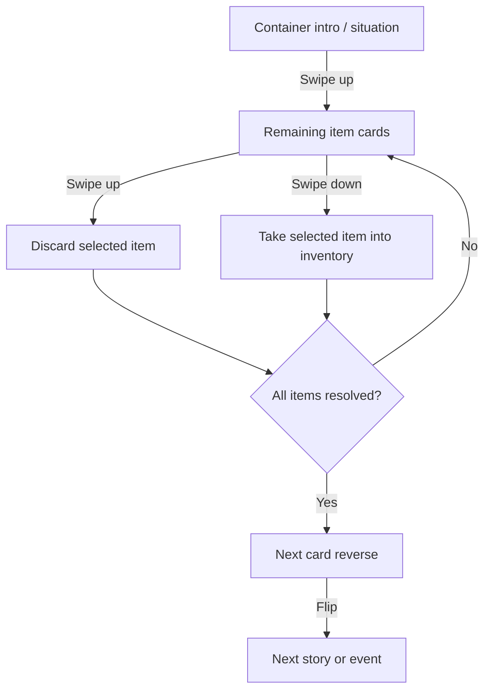
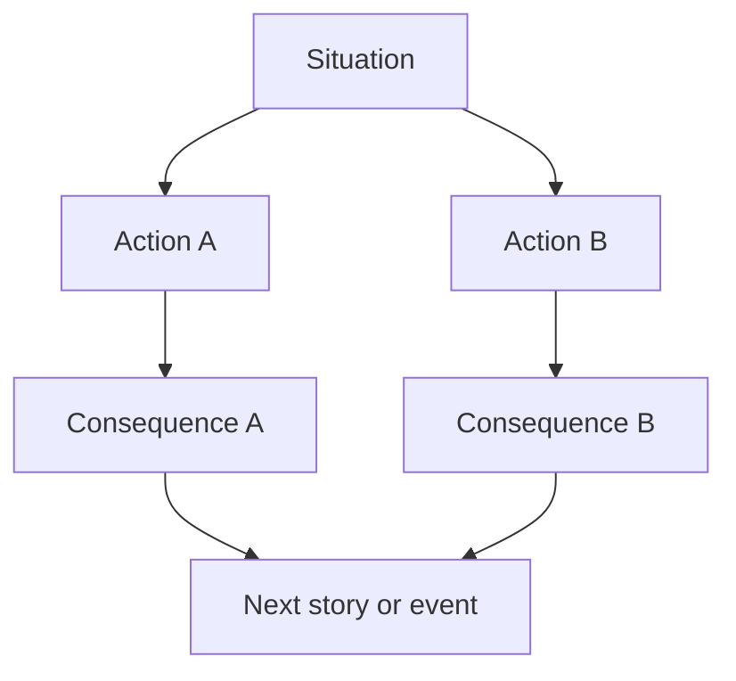
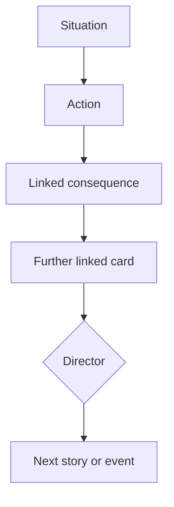
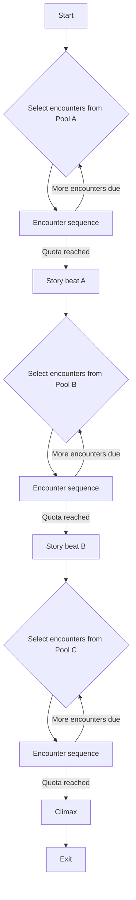

# Card sequence catalog

Card Adventure progresses through sequences of situation, action, item, and consequence cards. This catalog records how each sequence starts, branches, and returns to the next story or event. The container flow is confirmed; the other flows describe the baseline in the newer prototype spec.

## Reading the schemes

- Rectangles represent cards visible to the player.
- Arrows represent progression. Labels on arrows describe conditions, not additional cards.
- Diamonds represent system routing or state checks, not visible cards.
- **Next story or event** means the continuation selected by the chapter or Director. It can also be an explicitly linked card.

Mermaid diagrams render in Markdown viewers that support Mermaid. The compact text schemes remain readable in any text editor.

## Container sequence

**Status: Confirmed.**

A container begins with a situation card covering its item cards. One swipe up lifts this description and reveals the item carousel directly. There is no Open / Leave action selection and no lid effect.

```text
[Container intro] -> swipe up -> [Item] [Item] [Item]
  item swipe up -> discard -> remaining items
  item swipe down -> take -> bottom inventory -> remaining items
  last item leaves -> [Next card reverse] -> flip -> [Next story or event]
```



Browse items with left or right gestures. Taking or discarding moves only the selected card. Every item must be resolved; there is no early exit from the opened container. A short or canceled gesture restores the item without changing inventory or container contents.

During the last item's departure, the next card's reverse is revealed underneath. It flips to the front only after the outgoing item clears its turning area. This applies both to taking downward and discarding upward. No empty container screen or extra Continue action is required.

Only taken items appear in the temporary bottom inventory. The strip shows thumbnails, names, and a count, with horizontal scrolling. Using, equipping, and inspecting inventory cards are deferred. Inventory survives events in the current run and resets with restart or page reload.

Containers always start with at least one item. Lock-picking and resource conditions remain future design work.

## Situation and choice sequence

**Status: Baseline from the newer prototype spec.**

A situation card leads to two to four action cards. Swiping up on the situation reveals choices; swiping left or right browses actions; swiping up on an action commits it. The chosen action leads to its consequence and then the continuation.

```text
[Situation] -> choose one of [Action A] [Action B] -> [Consequence] -> [Next story or event]
```



Choices can add or remove state tags. Available choices may depend on tags or equipment. Containers use their own direct reveal and item-resolution flow above.

## Linked consequence sequence

**Status: Baseline from the newer prototype spec.**

An action can point to a specific card, allowing a short authored sequence before control returns to the Director. Consequences may also be deferred and appear later when their conditions are met.

```text
[Situation] -> [Action] -> [Linked consequence] -> [Further linked card] -> Director -> [Next story or event]
```



The additional linked card is optional. The data model uses an explicit card ID to continue an authored sequence and `next: director` to resume procedural selection. Whether linked consequences count toward the encounter quota between story beats remains open.

## Chapter progression sequence

**Status: Baseline from the newer prototype spec.**

Each chapter combines mandatory authored moments with encounters selected from controlled pools. The Director checks the current chapter stage, tags, weights, previously seen cards, and encounter count.

```text
[Start] -> Pool A encounters -> [Story beat A] -> Pool B encounters
        -> [Story beat B] -> Pool C encounters -> [Climax] -> [Exit]
```



Each encounter sequence can use one of the patterns above. The climax can have variants affected by previous decisions. Encounter quotas and the fallback when no eligible cards remain still need concrete rules.

## Sequences awaiting definition

The older Nest design also describes combat, crafting, charging, revisiting locations, battery depletion, and death sequences. Their card flows are not yet defined here; the newer prototype spec defers combat, inventory, statistics, and meta-progression until the core experience is validated.

## Adding a sequence

For each new sequence, record:

1. **Status** — confirmed, baseline, or proposed.
2. **Entry** — the situation or trigger that starts it.
3. **Cards and branches** — a compact text scheme and Mermaid diagram.
4. **State changes** — tags or resources affected by actions.
5. **Completion** — the condition that advances to the continuation.
6. **Open decisions** — behavior still requiring a design choice.

## Design sources

- [New Card Adventure prototype spec](NEW_Card%20Adventure%20%E2%80%94%20mechanizm%20gry%20_%20spec%20do%20prototypu.docx)
- [Older Nest game design](OLD_Nest_%20Game%20Design%20Document.docx)
- Container behavior confirmed in the design discussion: one swipe reveals items; up discards and down takes; all items must be resolved; the last item reveals the next reverse and flip; containers start with at least one item.
